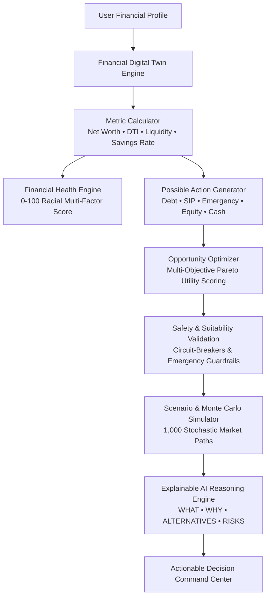

# FINARCH AI
### *Your Autonomous Financial Decision Engine*

[](https://reactjs.org/)
[](https://fastapi.tiangolo.com/)
[](https://www.typescriptlang.org/)
[](https://tailwindcss.com/)
[](https://opensource.org/licenses/MIT)

> **"Don't just invest your money. Make the best financial decision."**

---

## 1. Problem
Traditional fintech applications and Robo-advisors focus strictly on: **"What should I invest in?"** (e.g., recommending a stock or mutual fund). 

However, real-world personal finance requires answering a more fundamental, holistic question:
$$\text{"What should I do with my next ₹10,000?"}$$

Investors frequently make catastrophic capital allocation mistakes:
- Investing in volatile equities while carrying revolving credit card debt at **38% APR**.
- Draining emergency liquidity into illiquid assets right before job or medical emergencies.
- Holding excessive cash buffers (>35%) losing real purchasing power to **5.5% inflation**.
- Suffering from isolated decision silos without multi-objective trade-off analysis.

---

## 2. Solution
**FINARCH AI** is an autonomous financial decision engine. It models a user's complete balance sheet as an interactive **Financial Digital Twin** and uses multi-objective optimization, 10-year dual-strategy simulation, and 1,000-path stochastic **Monte Carlo** stress testing to rank and explain competing financial actions:

- 💳 **Pay down high-interest debt**
- 🛡️ **Build emergency reserve buffer**
- 📈 **Increase systematic equity SIP**
- 🚀 **Allocate to high-growth equities**
- ⚖️ **Rebalance existing portfolio**
- 🔒 **Fixed income & Sovereign Gold Bonds**
- 💵 **Hold tactical liquidity**

---

## 3. System Architecture & Decision Pipeline



---

## 4. Key Features

| Feature | Description |
| :--- | :--- |
| **Financial Digital Twin** | Real-time balance sheet modeling across income, expenses, assets, liabilities, and risk tolerance. |
| **Financial Health Score** | Transparent 0–100 radial score broken down into Emergency, Debt, Savings, Diversification, Goals, and Risk. |
| **AI Decision Engine** | Core engine ranking competing capital allocations for any custom amount (e.g. ₹10,000 vs ₹50,000). |
| **Opportunity Optimizer** | Multi-objective optimization matrix with user-customizable objective weight sliders. |
| **Portfolio Intelligence** | Modern Portfolio Theory asset allocation donuts, concentration alerts, and risk vs return scatter plots. |
| **Multi-Goal Tracker** | Progress milestones with automated monthly required contribution sufficiency checks. |
| **What-If Simulator** | Dynamic scenario levers (salary hike, expense spike, market crash -20%, loan prepayment) with dual 10-year curves. |
| **Monte Carlo Engine** | 1,000 simulated market cycles generating 10th/50th/90th percentile wealth fan charts and probability of goal success. |
| **Explainable AI Advisor** | Conversational agent breaking down exact **WHAT, WHY, ALTERNATIVES, ASSUMPTIONS, and RISKS**. |
| **Dual Offline/Online Mode** | 100% operational offline with embedded client-side math engine, plus FastAPI backend support. |

---

## 5. Multi-Objective Decision Formula

FINARCH AI ranks competing actions using a normalized utility function:

$$\text{Decision Score} = \left( w_{\text{ret}} \cdot \frac{R}{30} \cdot 100 \right) + \left( w_{\text{risk}} \cdot (100 - \sigma) \right) + \left( w_{\text{liq}} \cdot L \right) + \left( w_{\text{debt}} \cdot D \right) + \left( w_{\text{goal}} \cdot G \right) - P_{\text{tax}} - P_{\text{fee}}$$

Where:
- $R$: Expected annualized return / debt interest saved (%)
- $\sigma$: Asset class volatility / drawdown score (0–100)
- $L$: Liquidity accessibility rating (0–100)
- $D$: Debt elimination impact score (0–100)
- $G$: Target goal milestone acceleration score (0–100)
- $P_{\text{tax}}, P_{\text{fee}}$: Post-tax drag and expense ratio penalties

---

## 6. Tech Stack

- **Frontend**: React 19, TypeScript, Vite, Tailwind CSS, Recharts, Lucide React, Framer Motion
- **Backend**: Python 3.11+, FastAPI, Uvicorn, SQLAlchemy, SQLite/PostgreSQL, NumPy, Pandas, Pytest
- **AI Layer**: Deterministic Explainable AI Engine + Optional OpenAI / Google Gemini API connector
- **DevOps**: Docker, Docker Compose, GitHub Actions (`deploy.yml` for GitHub Pages)

---

## 7. Quickstart & Installation

### Option A: Run Full Stack (Frontend + Backend)

#### 1. Clone the repository
```bash
git clone https://github.com/your-username/finarch-ai.git
cd finarch-ai
```

#### 2. Start Python Backend
```bash
cd backend
python -m venv venv

# Windows
.\venv\Scripts\activate
# macOS/Linux
source venv/bin/activate

pip install -r requirements.txt
python -m uvicorn app.main:app --reload --port 8000
```
*API will run at `http://localhost:8000` (Interactive docs at `http://localhost:8000/docs`)*

#### 3. Start React Frontend
```bash
cd ../frontend
npm install
npm run dev
```
*Frontend will run at `http://localhost:5173`*

---

### Option B: Run via Docker Compose
```bash
docker-compose up --build
```
*Frontend: `http://localhost` | Backend API: `http://localhost:8000`*

---

### Option C: Run Standalone Frontend (GitHub Pages / Zero Backend)
```bash
cd frontend
npm install
npm run dev
```
*FINARCH AI features an embedded client-side decision engine that provides 100% functionality even without a running backend.*

---

## 8. Demo Profile Walkthrough for Judges

1. Open the application and click **"Launch FINARCH"** or **"Load Demo Profile"**.
2. **Overview**: Observe the Financial Health Score (**82/100**) and the **Highest-Value Action** banner recommending *Pay Down High-Interest Debt* (Credit Card @ 38% APR).
3. **Financial Digital Twin**: Click *Edit Digital Twin* to modify salary, expenses, or debts and observe instant recalculation of Net Worth and emergency coverage.
4. **AI Decision Engine**: Slide the capital selector from ₹10,000 to ₹50,000 and view real-time re-ranking of actions A through G. Click **"Why?"** for full explainable breakdowns.
5. **Opportunity Optimizer**: Customize objective weight sliders (e.g. prioritize Liquidity vs Return) to see the Pareto optimization adapt dynamically.
6. **What-If Simulator**: Toggle the **-20% Market Crash** or **+₹5,000 SIP** presets to see dual-strategy curves over 10 years.
7. **Monte Carlo**: Switch to the *1,000 Monte Carlo Paths* tab to inspect 10th/50th/90th percentile fan charts and probability distributions.
8. **AI Advisor**: Click quick inquiry pills (e.g., *"Can I afford a ₹3 lakh bike?"*) to receive structured **WHAT, WHY, ALTERNATIVES, and RISKS**.

---

## 9. API Reference

| Method | Endpoint | Description |
| :--- | :--- | :--- |
| `GET` | `/api/health` | Service health status |
| `GET` | `/api/profile` | Get current financial digital twin profile |
| `PUT` | `/api/profile` | Update financial profile parameters |
| `POST` | `/api/profile/reset-demo` | Reset to standard hackathon demo profile |
| `GET` | `/api/financial-twin` | Retrieve complete twin metrics & health |
| `GET` | `/api/health-score` | Compute 0–100 health score with sub-scores |
| `POST` | `/api/analyze?amount=10000` | Evaluate next capital action ranking |
| `POST` | `/api/optimize` | Multi-objective opportunity optimization |
| `POST` | `/api/simulate` | Deterministic dual-strategy scenario simulator |
| `POST` | `/api/simulate/monte-carlo`| 1,000-path stochastic Monte Carlo engine |
| `GET` | `/api/goals` | List all tracked financial goals |
| `POST` | `/api/goals` | Add a new financial goal milestone |
| `POST` | `/api/ai/chat` | Explainable conversational financial agent |
| `GET` | `/api/market/demo` | Market regulatory benchmarks & knowledge layer |

---

## 10. Automated Tests

Run backend unit tests:
```bash
cd backend
.\venv\Scripts\python -m pytest tests
```
*Output: `5 passed in test_financial_engine.py (100%)`*

---

## 11. Disclaimer
**FINARCH AI** is a decision-support prototype built for educational and demonstration purposes. It does not constitute financial, investment, tax, or legal advice. Market returns are uncertain and simulated results are not guarantees.
